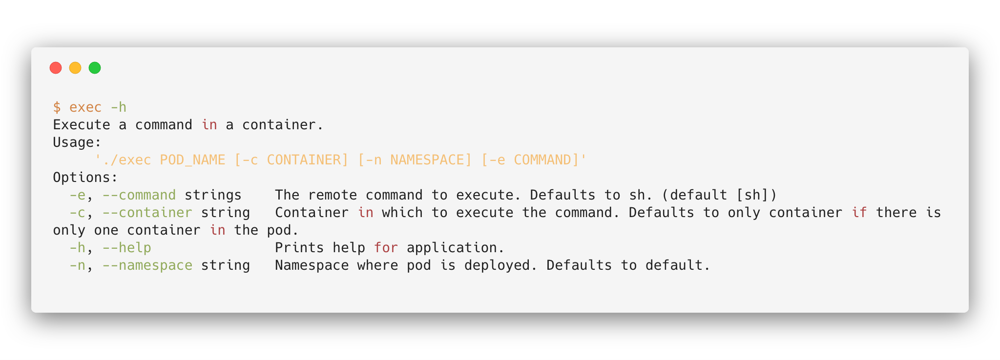

# Kubernetes pod exec showcase

## Overview

The Kubernetes Pod Exec Showcase project shows the easiest implementation of the `kubectl exec` command. 

## Prerequisites

To set up the project, use these tools:
* The 1.11 or higher version of [Go](https://golang.org/dl/)
* The latest version of [Dep](https://github.com/golang/dep)

## Usage

To build a binary use this command: 

```bash
go build -o exec main.go
```

Then you are ready to use this tool.


